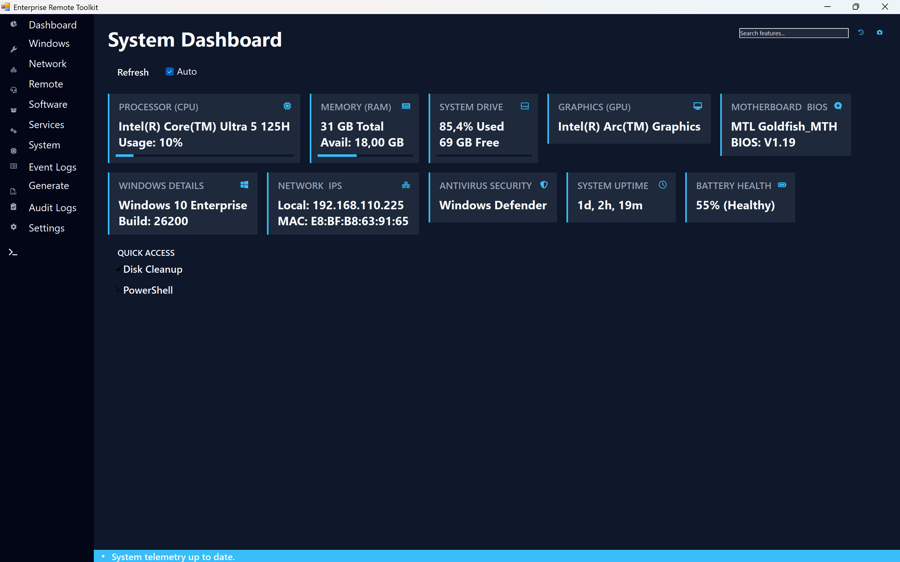
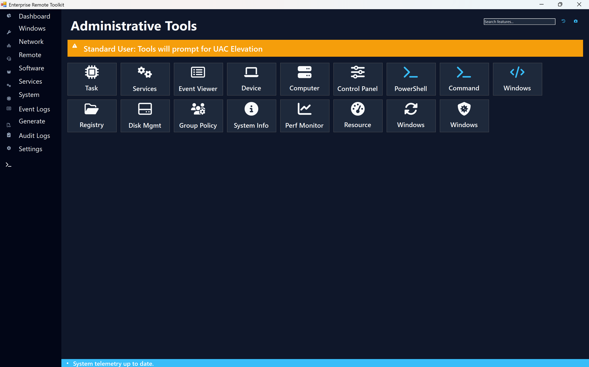
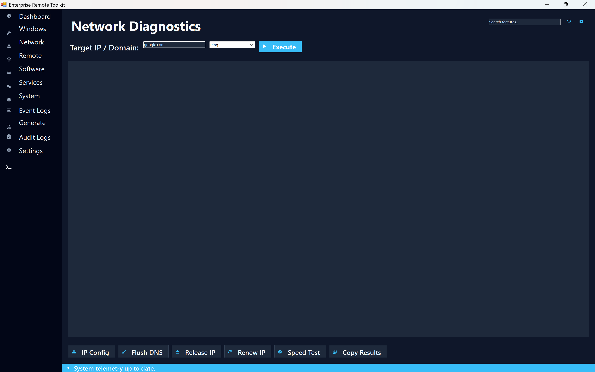
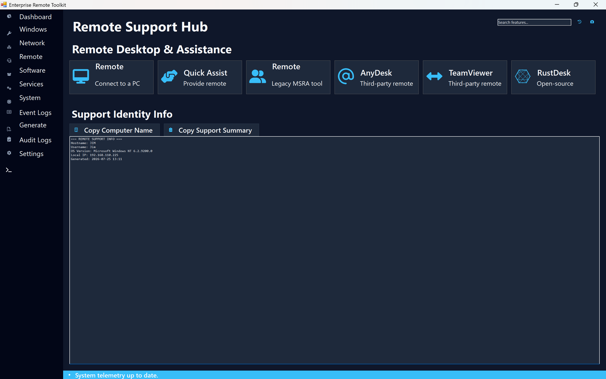
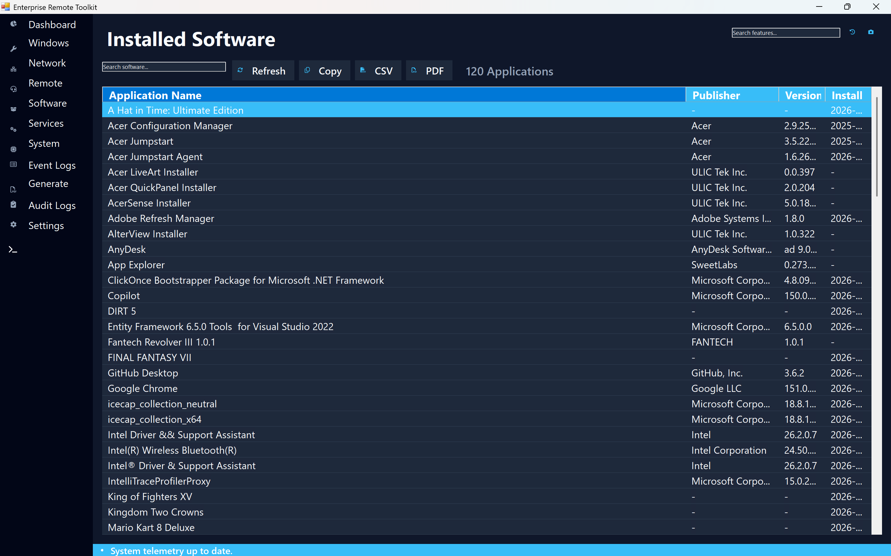
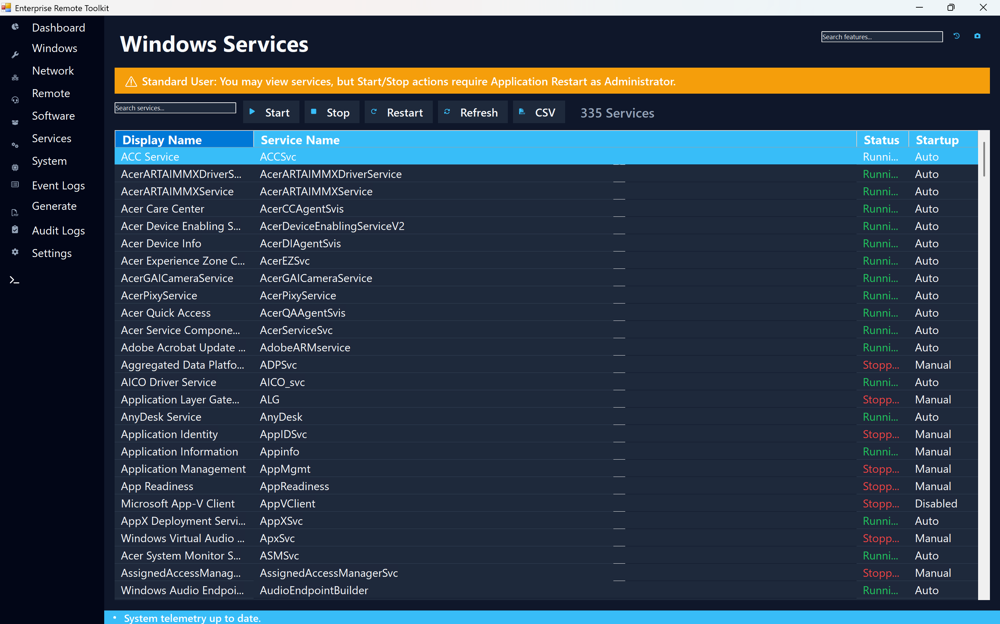
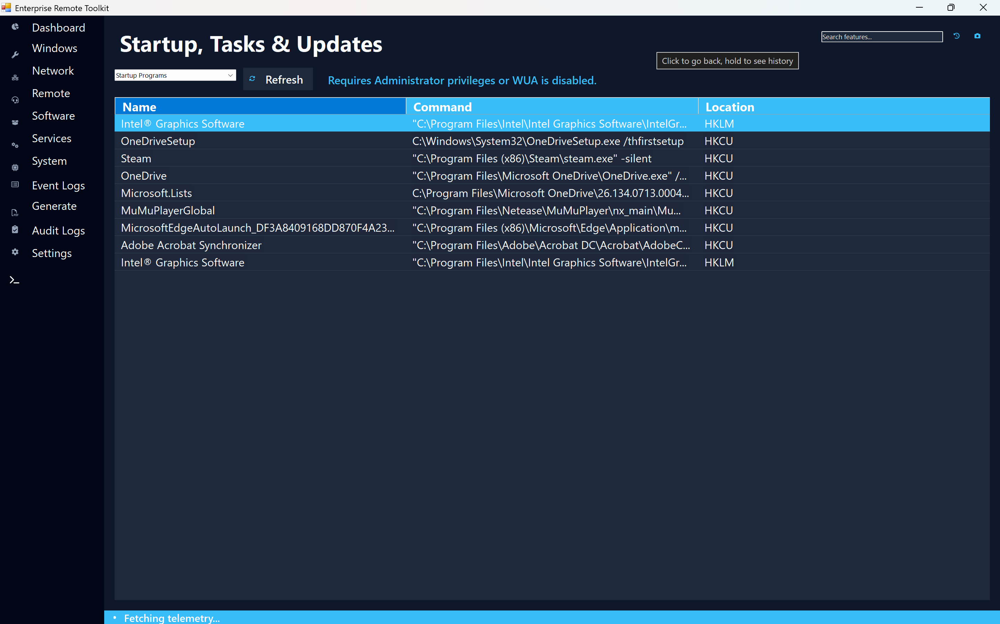
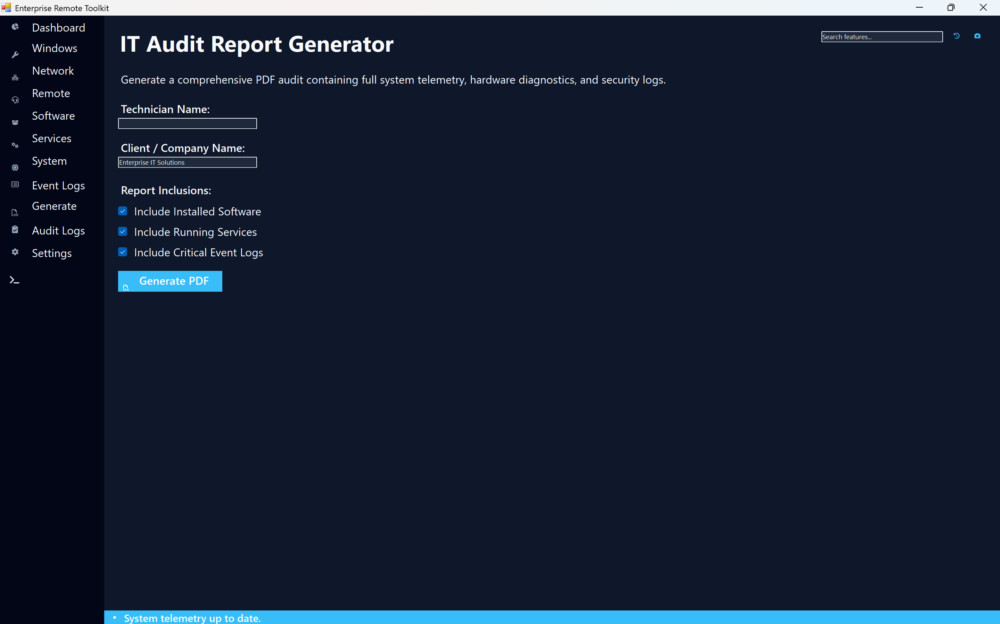

# Enterprise Remote Toolkit

[](https://docs.microsoft.com/en-us/dotnet/csharp/)
[](https://dotnet.microsoft.com/)
[](https://www.microsoft.com/windows)
[](https://opensource.org/licenses/MIT)

A modern, enterprise-grade Windows System Administration, Telemetry, and Remote Support Desktop Toolkit. Built with C# and .NET for IT administrators, system engineers, and helpdesk teams to manage system diagnostics, services, network configurations, and generate professional PDF audit reports through a unified dark-mode interface.

---

## 📋 Table of Contents
- [Key Features](#-key-features)
- [Application Screenshots](#-application-screenshots)
- [System Architecture](#-system-architecture)
- [Design & Implementation Details](#-design--implementation-details)
- [Security & Privacy](#-security--privacy)
- [Tech Stack](#-tech-stack)
- [Project Structure](#-project-structure)
- [Getting Started & Build](#-getting-started--build)
- [License](#-license)

---

## ✨ Key Features

### 🖥️ 1. Real-Time System Telemetry Dashboard
- Live hardware telemetry: Processor (CPU), RAM utilization, System Drive storage (% used/free), GPU, and Motherboard BIOS information.
- Operating system details: Windows build version, Local IP address, MAC address, and Antivirus status (Windows Defender).
- Live metrics tracking: System uptime timer and Laptop Battery Health indicator.
- Quick Access shortcuts to `Disk Cleanup` and `PowerShell`.

### 🛠️ 2. Administrative Tools Launcher
- One-click launcher for 15+ native Windows administration tools:
  - **Core Utilities:** Task Manager, Services, Event Viewer, Device Manager, Computer Management, Control Panel, PowerShell, Command Prompt, Windows Tools.
  - **Advanced Tools:** Registry Editor, Disk Management, Group Policy Editor, System Info, Performance Monitor, Resource Monitor, Windows Update, Windows Security.
- **Smart UAC Awareness:** Automatically detects user permissions and displays an alert banner when running under a Standard User account.

### 🌐 3. Network Diagnostics Hub
- Target domain/IP troubleshooting tool supporting `Ping` and network queries.
- Quick network actions:
  - `IP Config` (`ipconfig`)
  - `Flush DNS` (`ipconfig /flushdns`)
  - `Release IP` & `Renew IP`
  - `Speed Test` execution
  - One-click `Copy Results` to clipboard.

### 🎧 4. Remote Support Hub
- Unified launcher for both native Windows Remote Desktop/Assistance tools and popular 3rd-party remote utilities:
  - **Native:** Windows Remote Desktop (RDP), Quick Assist, Legacy MSRA.
  - **Third-Party:** AnyDesk, TeamViewer, RustDesk.
- **Support Identity Generator:** Instantly copies hostname, username, OS version, local IP, and timestamp into a standardized support log summary for helpdesk ticketing.

### 📦 5. Installed Software & Windows Services Management
- **Installed Software Inventory:** Scans and indexes all installed desktop applications (with publisher, version, and install date). Supports filtering, copying, and exporting data to **CSV** or **PDF**.
- **Windows Services Control:** Interactive service manager to inspect 300+ Win32 services with status filtering (Running / Stopped) and controls to **Start**, **Stop**, or **Restart** services (requires administrative elevation).

### ⚙️ 6. Startup, Tasks & Updates Auditor
- Inspect system startup applications, registry run keys (`HKLM`, `HKCU`), scheduled tasks, and Windows Update status.

### 📄 7. IT Audit Report Generator
- Automated PDF report builder designed for IT consulting and client site audits.
- Configurable parameters: **Technician Name** and **Client / Company Name**.
- Customizable report inclusions:
  - Installed Software Inventory
  - Currently Running Win32 Services
  - Critical System Event Logs
- One-click **Generate PDF** output.

---

## 📸 Application Screenshots

| System Telemetry Dashboard | Administrative Tools |
|:---:|:---:|
|  |  |

| Network Diagnostics | Remote Support Hub |
|:---:|:---:|
|  |  |

| Installed Software Inventory | Windows Services Manager |
|:---:|:---:|
|  |  |

| Startup & Tasks Auditor | IT Audit Report Generator |
|:---:|:---:|
|  |  |

---

## 🏗️ System Architecture

```mermaid
graph TD
    User([IT Administrator / Technician]) --> UI[WPF Desktop Application UI]
    
    subgraph Application Modules
        UI --> Telemetry[System Telemetry Engine]
        UI --> AdminTools[Admin Process Invoker]
        UI --> NetDiag[Network Diagnostic Tools]
        UI --> RemoteHub[Remote Session Manager]
        UI --> SoftwareSvc[Software & Services Auditor]
        UI --> PDFGen[PDF Audit Report Engine]
    end

    subgraph Windows Operating System Subsystems
        Telemetry --> WMI[WMI & System.Diagnostics API]
        AdminTools --> Shell[Windows Shell & UAC API]
        NetDiag --> NetAPI[System.Net.NetworkInformation]
        RemoteHub --> WinRDP[RDP / MSRA / 3rd Party Executables]
        SoftwareSvc --> Registry[Win32 Registry & ServiceController]
        PDFGen --> Disk[Local PDF File Export]
    end
